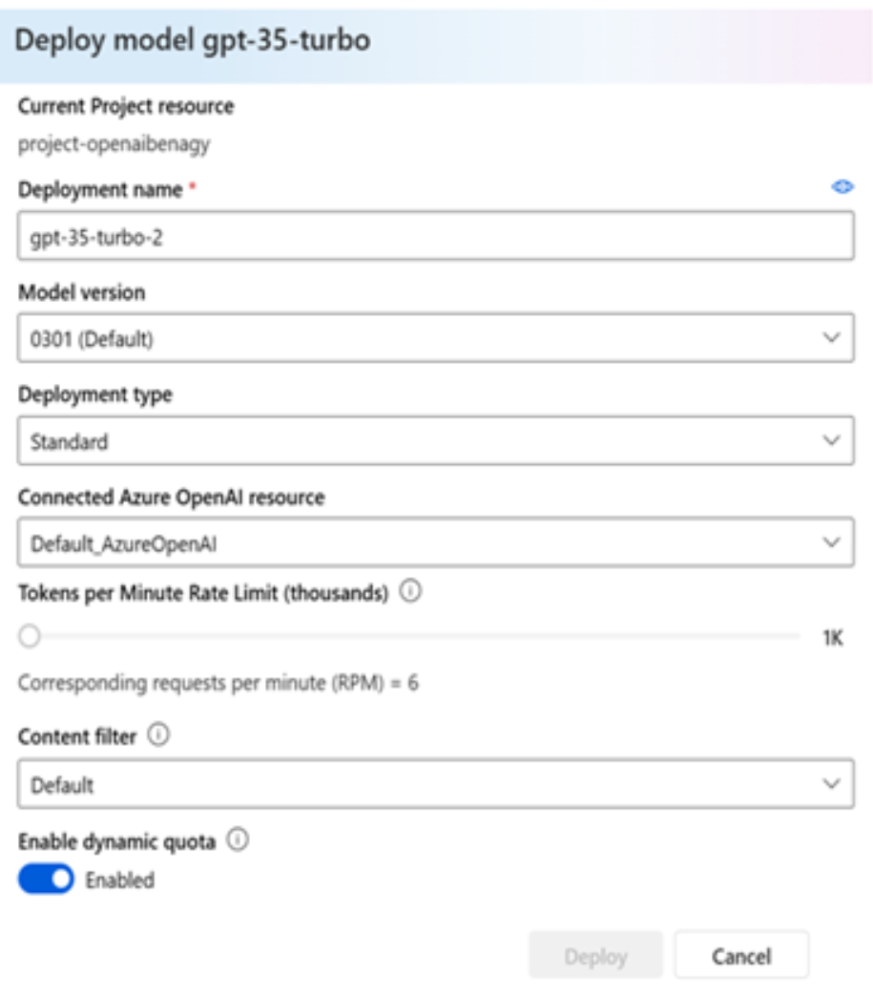
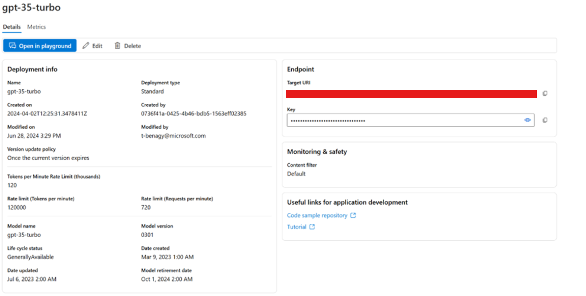

# Responsible AI Workshop - Deploying an LLM model in Azure and using it in Python 

Let's look at how to create a LLM model with Azure and how to deploy it in Python. In this note, we will deploy a GPT-3.5 model, but you can deploy all the OpenAI models from the [Model Catalog](https://ai.azure.com/explore/models). for more information see [Azure OpenAI Service models](https://learn.microsoft.com/en-us/azure/ai-services/openai/concepts/models#gpt-35). 

## Prerequisites 

Please make sure you have completed all the instructions in [Getting started with Azure](getting-started-with-azure.md) beforehand so that you have created your Azure account, your Hub and your project in [Azure AI Studio](https://azure.microsoft.com/en-us/products/ai-studio/)!  

You might consider completing the [Introduction to Azure AI Studio](https://learn.microsoft.com/en-us/training/modules/introduction-to-azure-ai-studio/) module on [Microsoft Learn](https://docs.microsoft.com/en-us/learn/).

## Deploying a Large Language Model (LLM) in Azure

Proceed with the following steps: 

1. In Azure AI Studio, from you project overview, at the bottom of the left-side pane, under **Components**, click **Deployments**.  

2. Click **+ Create deployment**. A **Select a model** dialog opens up.  

3. You have access to the whole Azure AI Model Catalog with more than 1600 base model options to choose from. Search for “*gpt-35-turbo*”, select it, and click **Confirm**. 

4. A **Deploy model gpt-35-turbo** dialog opens up. 

    <div style="text-align: center;">
        
    </div>


    a. Choose your preferred parameters before deploying, including the **Model version** and a **Tokens per Minute Rate Limit (thousands)** to automatically limit your team’s token consumption in case of a shared project. 

    b. Click **Deploy** to start the GPT 3.5 Turbo deployment. 

1. An overview of the deployment is then displayed in the main window of Azure AI Studio. You can see or access all the deployment’s details, including the API key required later. 

    <div style="text-align: center;">
        
    </div>

## Using it in Python 

Once you've deployed your model, you'll probably want to use it in various notebooks. 

Each notebook will already have some code reserved for calling the model. Here, we want to show readers how this translates and where to look for the relevant information. 

1. Save your key and endpoint in an .env file. We could do this in a custom variable, but we do it for security reasons. 

    a. Create a file with the name: .env 

    b. Fill the code with your own key and endpoint: 

```
AZURE_OPENAI_API_KEY="YOUR_KEY" 

AZURE_OPENAI_API_BASE="https://YOUR_ENDPOINT.openai.azure.com/" 
```
 
2. Write the following code in your Python document. This code can be different depending on the notebook, but you will have to pass the following information: 

    a. The model's name you gave in the variable *“name”* 

    b. The api_version, you should put the last version of your model or a specific one if you want to test a model at a specific moment. More information can be found [here](https://learn.microsoft.com/en-us/azure/ai-services/openai/reference). 

```
import os 

llm_config_dict = {"config_list": [{"model": "gpt-35-turbo",      

                                    "api_type": "azure", 

                                    "api_key": os.environ["AZURE_OPENAI_API_KEY"], 

                                    "api_version": "2024-06-01",  

                                    "base_url": os.environ["AZURE_OPENAI_API_BASE"]}] 

                  } 
```
 

 

 