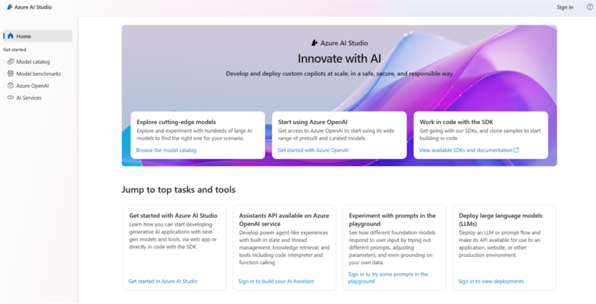
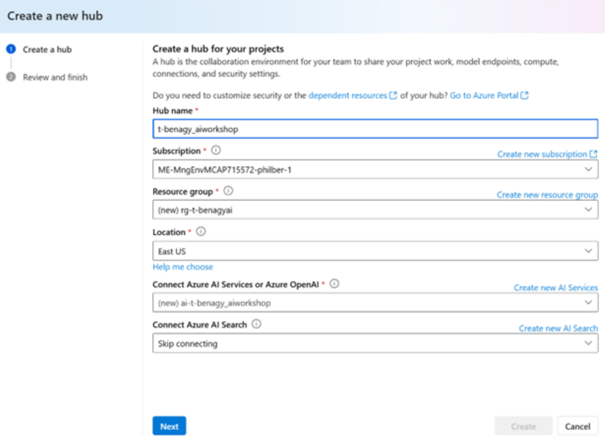
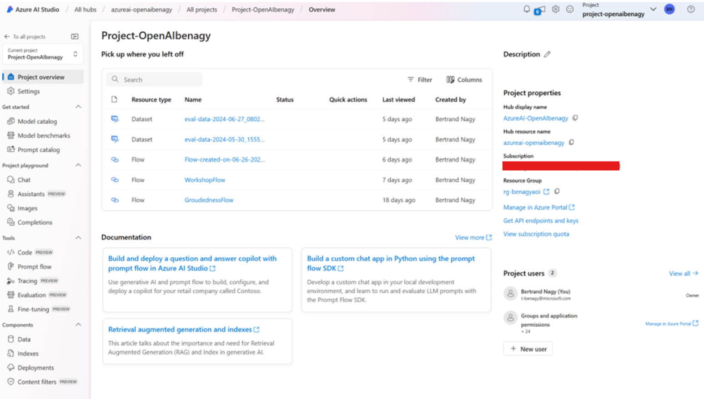

# Responsible AI Workshop - Getting started with Azure

**Azure** is a Microsoft cloud platform which provides a wide range of services, including computing power, storage solutions, and networking capabilities, which enable businesses to build, deploy, and manage applications efficiently. It supports various programming languages, frameworks, and operating systems, making it a versatile choice for developers. With robust security features and extensive compliance certifications, Azure ensures the protection of your data and applications. Additionally, its global network of data centers guarantees high availability and scalability, allowing enterprises to meet their evolving technological needs. 

## Azure Subscription 

To use this platform, you must sign up for an Azure subscription. If you don't already have one, you can create a free Azure account [here](https://azure.microsoft.com/en-us/free/). 

Visit the [Azure portal](https://portal.azure.com) and sign in with your Azure account credentials. 

## Azure OpenAI Service 

As part of Microsoft's commitment to responsible AI, the Azure OpenAI Service is designed and released with the intention of protecting the rights of individuals and society and fostering transparent human-computer interaction. For this reason, Azure OpenAI is a Limited Access service, and access and use is subject to eligibility criteria determined by Microsoft. Unless otherwise indicated in the service, all Azure customers are eligible for access to Azure OpenAI models, and all uses consistent with the [Product Terms](https://www.microsoft.com/licensing/terms/welcome/welcomepage) and [Code of Conduct](https://learn.microsoft.com/en-us/legal/cognitive-services/openai/code-of-conduct?context=/azure/ai-services/openai/context/context) are permitted, so customers are not required to submit a registration form unless they are requesting approval to modify content filters and/or abuse monitoring.

Azure OpenAI Service is made available to customers under the terms governing their subscription to Microsoft Azure Services, including [Product Terms](https://www.microsoft.com/licensing/terms/welcome/welcomepage) such as the Universal License Terms applicable to Microsoft Generative AI Services and the product offering terms for Azure OpenAI. Please review these terms carefully as they contain important conditions and obligations governing your use of Azure OpenAI Service.

 Please refer to [Limited access to Azure OpenAI Service](https://learn.microsoft.com/en-us/legal/cognitive-services/openai/limited-access?context=%2Fazure%2Fai-services%2Fopenai%2Fcontext%2Fcontext) for additional information. 

## Create an Azure AI Hub 

A hub is a collaborative group of projects and connections. To create projects, you will need first to create a Hub! 

Process with the following steps: 

1. Open a browsing session and navigate to [Azure AI Studio](https://ai.azure.com/).  

 

1. At the top right corner, click **Sign-in**, and sign-in with your credentials. 

2. On the left-side pane, go to **All hubs**. If this is your first project in the Studio, create a hub by clicking on **New hub**. A **Create a new hub** dialog opens up.   

    a. In **Hub name**, choose a hub name. 

    b. In **Subscription**, select your subscription in the dropdown list. Click **Create new subscription** if you haven’t any subscription yet. 

    c. In **Resource group**, select an existing resource group in the dropdown list or alternatively click **Create new resource group**, and then specify a resource group name. 

    d. In **Location**, select the location of the hub to be created. 

    **Important note**: at the time of this writing, certain Content Safety capabilities covered in the following pages are in preview and only available when the model is deployed in the East US datacenters. Therefore, we recommend selecting this location for your hub.  

    e. In **Connect Azure AI Services or Azure OpenAI**, select your Azure OpenAI service instance. Or click **Create new AI Services** to create one. To obtain access to the Azure OpenAI service, you have to priorly submit a registration form [here](https://aka.ms/oai/access). 

    f. In **Connect Azure AI Search**, ensure **Skip connecting** is selected. 

     

    g. Click **Next**. 

## Create a Project 

After creating the Hub, we can now create a project where we will deploy our different resources and models. 

1. When inside your hub, under **Projects**, now click **+ New project** on the hub overview page. A **Create a project** dialog opens up. 

    a. In **Project name**, specify a project name. For example, “*Project-OpenAIbenagy*” in our illustration. 

    b. Click **Create a project**. 

2. Once the project is created, a **Project overview** is displayed in the main window of Azure AI Studio. 

 

