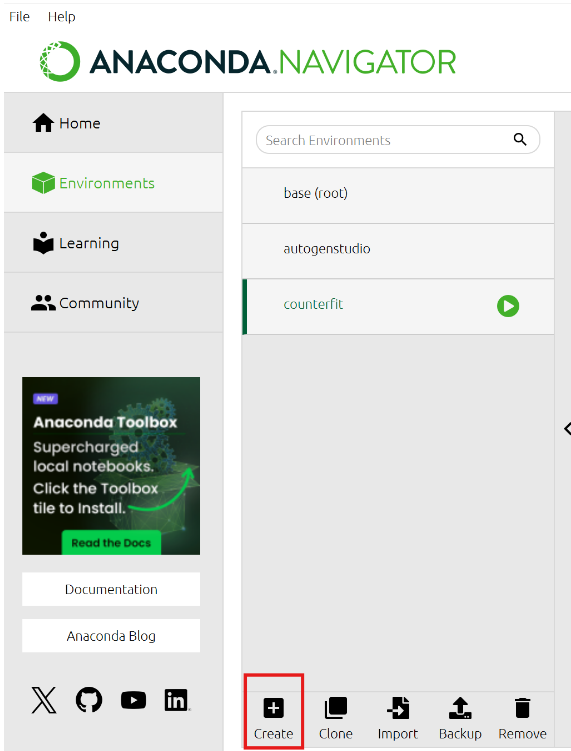
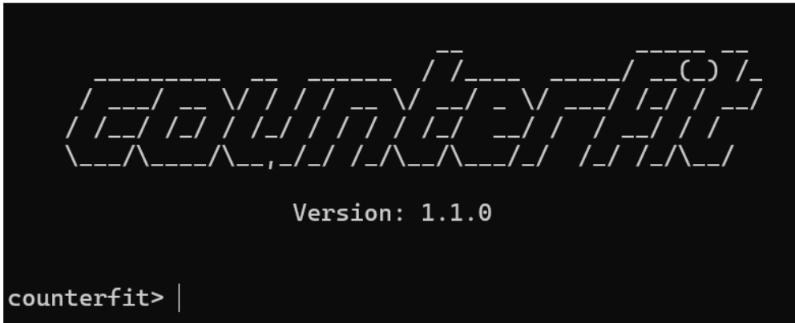

# Responsible AI Workshop - Leveraging Counterfit 

To perform the attack on (non-Generative AI models, we use the Counterfit tool which is a command-line tool that provides a generic automation layer for adversarial AI frameworks such as [Adversarial Robustness Toolbox](https://github.com/Trusted-AI/adversarial-robustness-toolbox) and [Text Attack](https://github.com/QData/TextAttack).  

This tool will allow you to implement attack scenarios on simple Machine Learning (ML) models.  

It is available on this [GitHub repository](https://github.com/Azure/counterfit) and you’ll find the instructions to set up the tool on README.md. However, if you occur the error described [here](https://learn.microsoft.com/en-us/troubleshoot/azure/azure-container-instances/configuration-setup/docker-hub-rate-limit-registryerrorresponse), follow this tutorial: 

1. You will create a environment in [conda](https://anaconda.org/anaconda/conda), launch the ananconda navigator app. Then go to environments and select create. 

<div style="text-align: center;">
        
    </div>

You will have to select the Python package with the **8.0 version**. 

2. The next step is to launch the environment by clicking on the play button. 

3. In the open terminal, we will first check the version of pip: 
    ```
    pip --version   
    ```

    If it’s higher than 24.0, enter the following command: 
    ```
    python –m pip install pip==24.0   
    ```

4. Then clone the Counterfit repository  
```
git clone https://github.com/Azure/counterfit.git 
```
5. Change to the Counterfit repository 
```
cd counterfit 
```
6. Install the development requirements using the following command: 
```
pip install .[dev] 
```
7. Download the additional file required for text attack functionality using the following command: 
```
python -c "import nltk;  nltk.download('stopwords')" 
```
7. Launch Counterfit using the following command: 
```
counterfit 
```
 <div style="text-align: center;">
        
    </div>