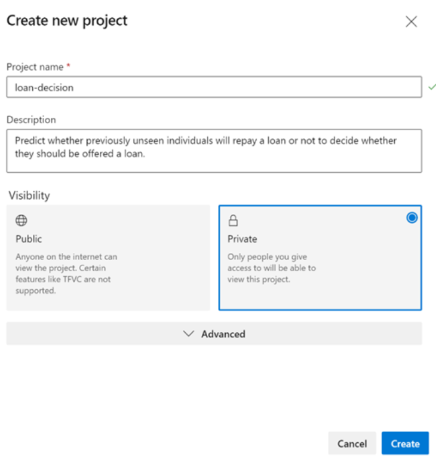
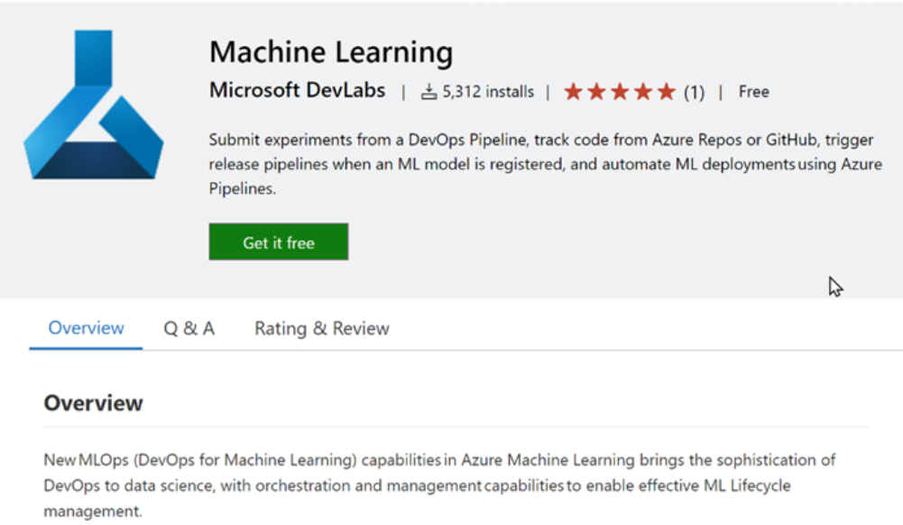
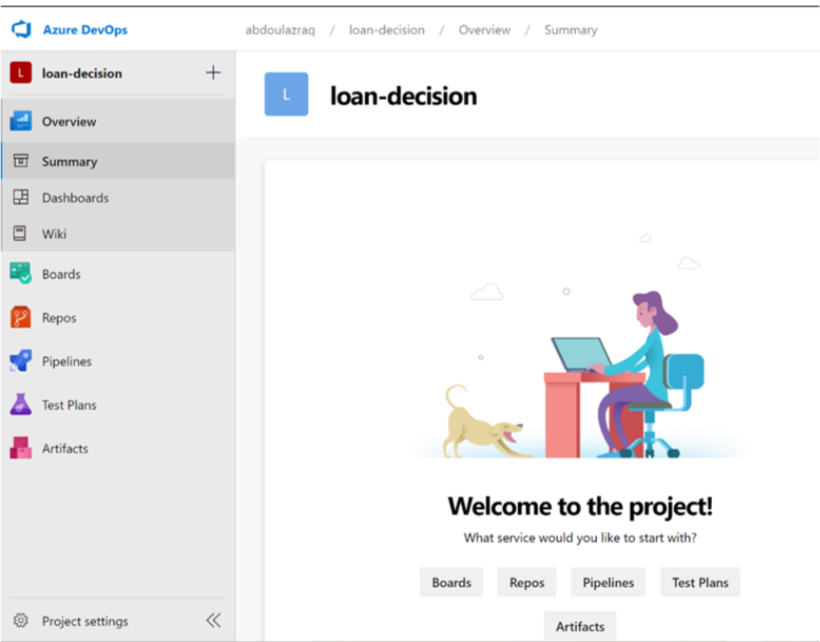
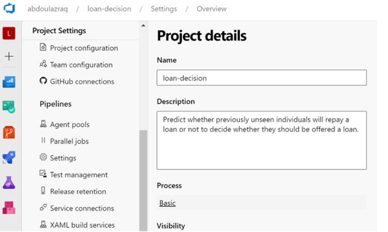
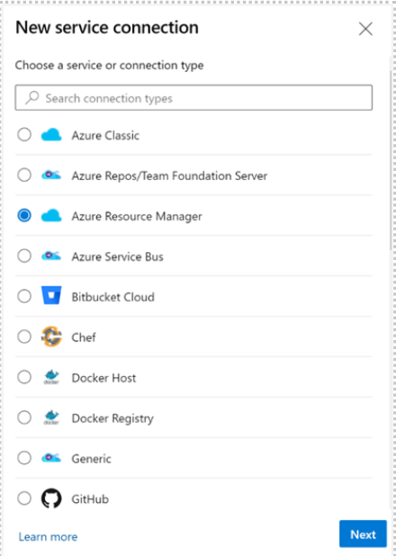
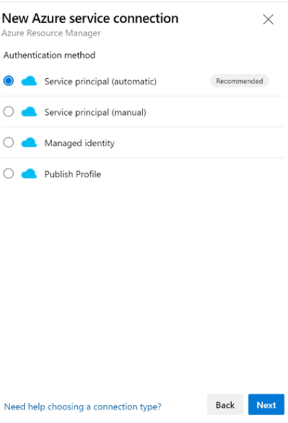
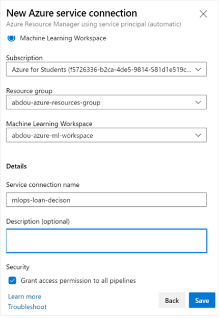
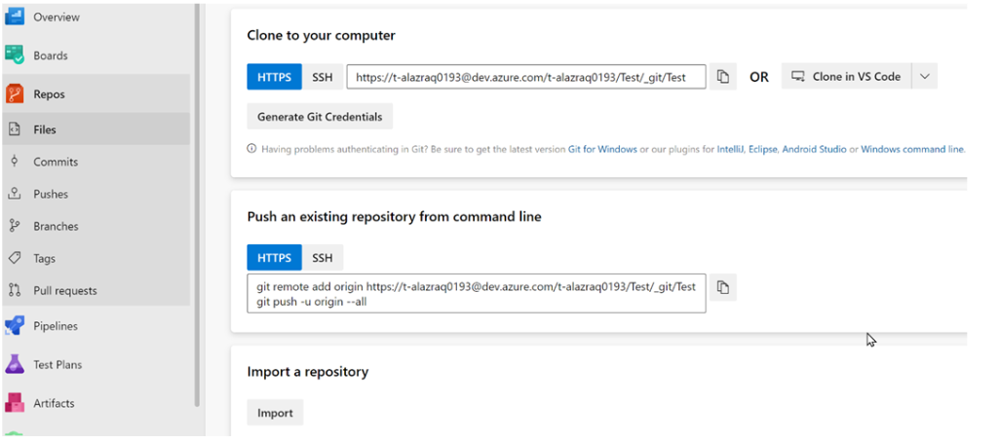
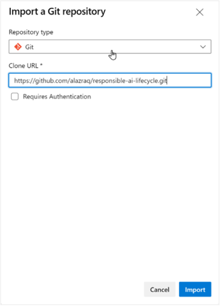

# Responsible AI Workshop - Setting up an Azure DevOps environment 

To set up the Dev(Sec)Ops environment, perform the following steps: 

1. Sign in to [Azure DevOps](https://azure.microsoft.com/en-us/services/devops/?nav=min) (with your Azure account). You can click on **Start free** if it is your first time using Azure DevOps or [Sign in to Azure DevOps](https://go.microsoft.com/fwlink/?LinkId=2014676&githubsi=true&clcid=0x409&WebUserId=50395eaee24b4a028eaf6120cb6392cc) if you already have an account. 

2. An organization is created based on the account you used to sign in by clicking **Create New Organization** if it is your first-time using Azure DevOps. Now you can create a new project, fill in the project name and description and hit **Create**. 

 

        
    

3. You now need to install the **Azure Machine Learning** extension to your organization from the [Visual Studio Code marketplace](https://marketplace.visualstudio.com/items?itemName=ms-air-aiagility.vss-services-azureml), so that you can set up a service connection to your Azure ML workspace. You can simply click on **Get it free**, and then follow the instructions to install the extension to your Azure DevOps organization. 

  

        
    

4. The fourth step is creating a service connection to your Azure ML workspace. Back to your Azure DevOps project’s pane, go to your project settings by clicking on the wheel icon on the bottom left. 

        
    

Then go to the **Service connections** section and select **Azure Resource Manager** when creating **New service connection**. You can then select the recommended Service principal authentication method. 

        
    

 
Select Azure Resource Manager as connection type: 

        
    

        
    

        
    

  

**Note**: Creating service connection using Azure Machine Learning extension requires 'Owner' or 'User Access Administrator' permissions on the Workspace. 

5. You now need to link your GitHub repository to your Azure DevOps workspace. To do that go to the Repos section in the Azure DevOps Dashboard. You’ll land on the page below where you can select Import then paste your cloning URL from GitHub and hot Import again. 

 

        
    

        
    

Your Azure DevOps environment is all set now, and we can jump right off to implementing the first training pipeline. 