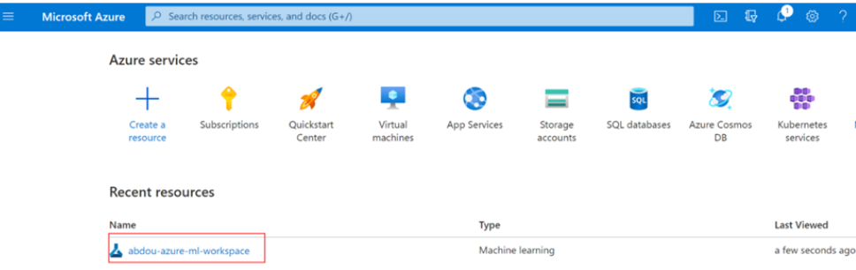
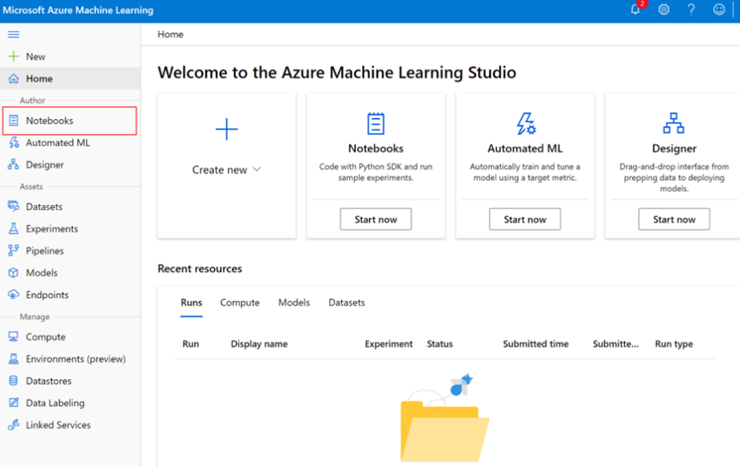
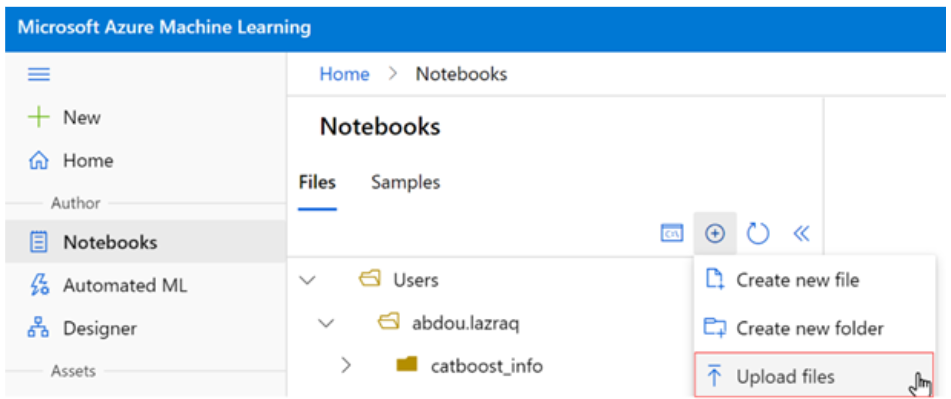
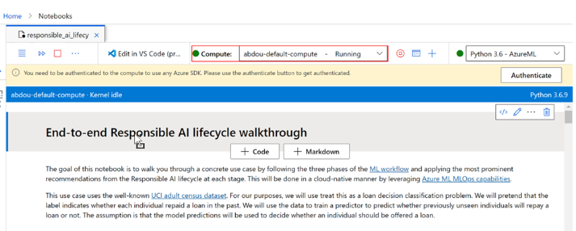

# Responsible AI Workshop - Using the Jupyter notebook in Azure Data Studio 

For some modules' guides of this workshop, you are advised to [use Jupyter notebooks on Azure Data Studio](https://docs.microsoft.com/en-us/sql/azure-data-studio/notebooks/notebooks-guidance?view=sql-server-ver15) to first to train a ML model and then package that model as a container image that can later be deployed as a local web service or another compute target like the aforementioned managed services Azure Container Instances (ACI) or Azure Kubernetes Service (AKS). 

[Azure Data Studio](https://learn.microsoft.com/en-us/azure-data-studio/what-is-azure-data-studio) is a lightweight, cross-platform data management and development tool for data professionals. As such, it takes advantage of an Azure ML workspace, which is a foundational block used to experiment, train, and deploy Machine Learning models. You can download Azure Data Studio for your environment [here](https://learn.microsoft.com/en-us/azure-data-studio/download-azure-data-studio?tabs=win-install%2Cwin-user-install%2Credhat-install%2Cwindows-uninstall%2Credhat-uninstall).

1. Access the ML workspace you created under recent resources or by looking up Machine Learning in the search bar and selecting your workspace. 

        
    

2. Click on **Launch Studio**. 

3. Select **Notebooks** from the side bar.  

        
    

4. Click on the Add file button and then on **Upload files**. 

 

        
    

5. Navigate to the cloned repo and select the your notebook and hit **Open**. This will open the notebook in Azure Data Studio, and you will be able to execute its cells after connecting your compute instance created as part of your ML workspace setup.  

 

        
    

At this stage, you’re all set! You can either continue with the execution of the cells of the notebook in Azure Data Studio or choose **Edit in VS Code** next to the compute field highlighted above to open the notebook in Visual Studio Code. You can download VS Code for your environment [here](https://code.visualstudio.com/).